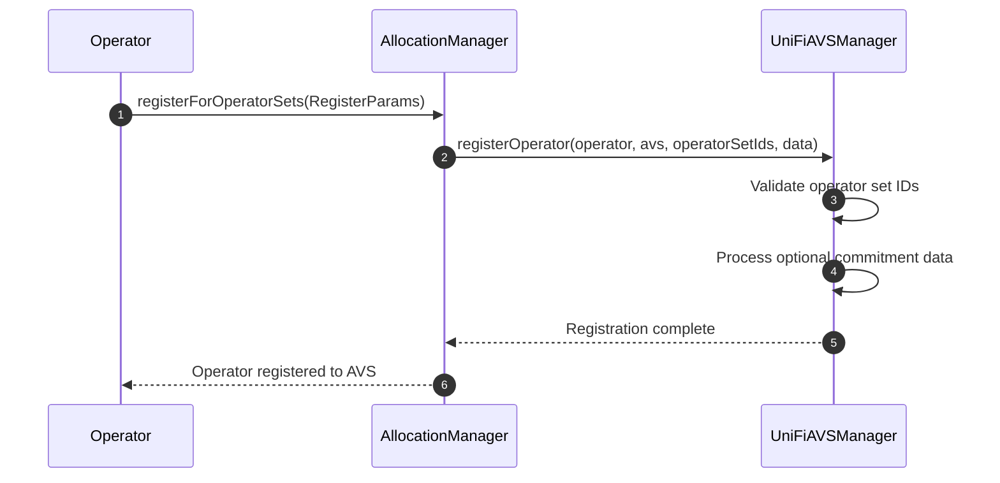
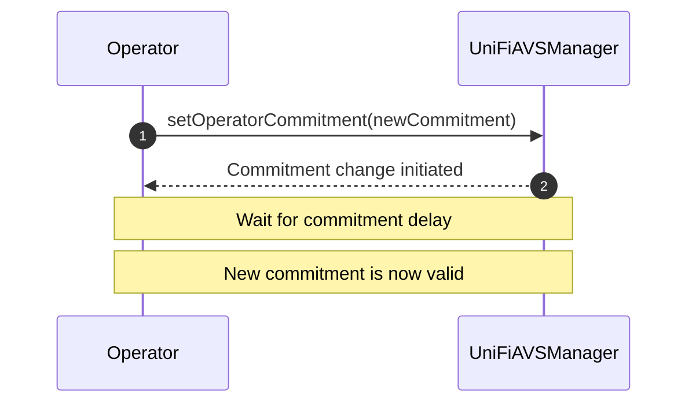
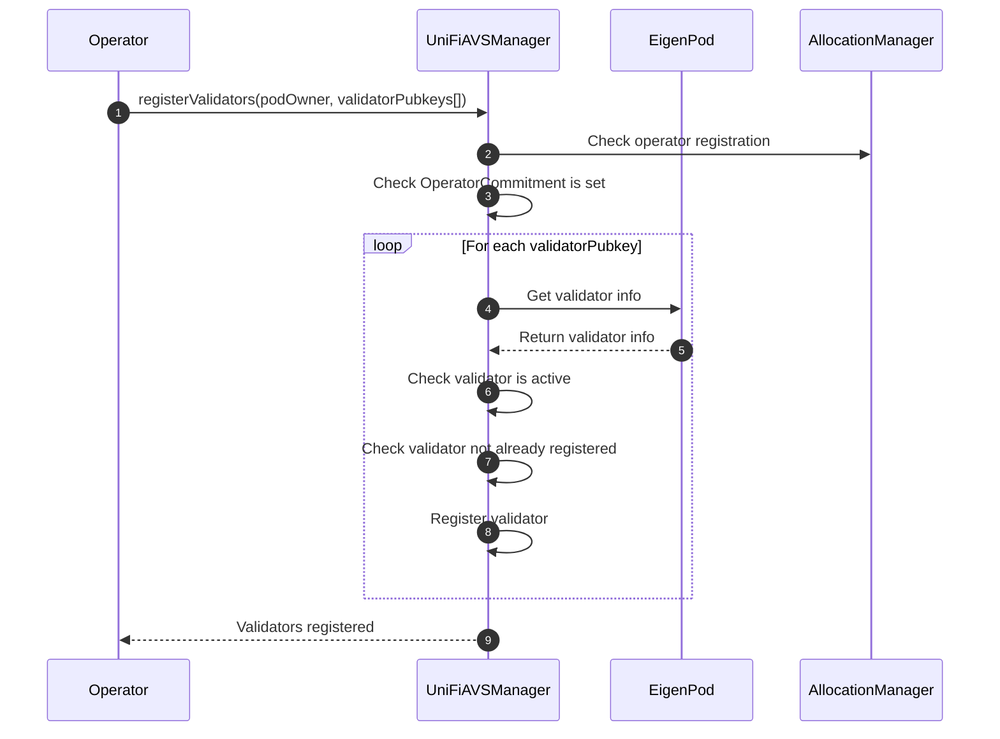
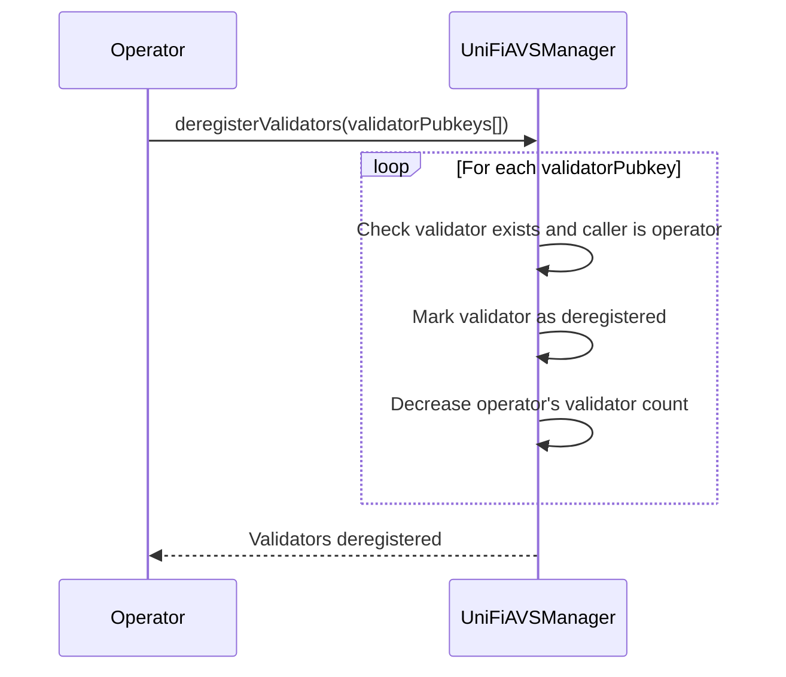
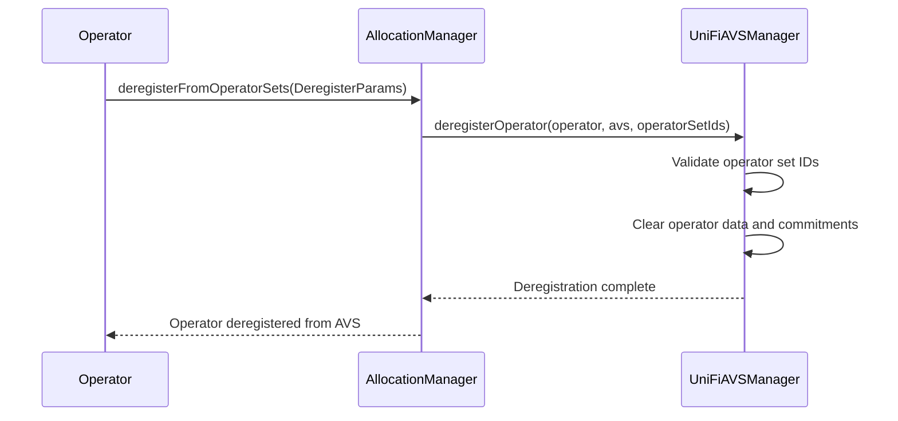

# Registering to UniFi AVS

## Registering an Operator


To join the UniFi AVS, operators register through EigenLayer's `AllocationManager`. It is assumed that the operator is already registered with EigenLayer's `DelegationManager`.

1. The operator calls `registerForOperatorSets()` on the `AllocationManager`, providing registration parameters including the AVS address, operator set IDs, and optional commitment data.

2. The `AllocationManager` calls `registerOperator()` on the `UniFiAVSManager` to complete the registration.

3. The `UniFiAVSManager` validates the operator set IDs and processes any optional commitment data provided during registration.

4. Once registered, the operator can begin registering validators and participating in the AVS.

### Set a Preconf Commitment

After the initial registration, the Operator needs to set their `OperatorCommitment`, which consists of a delegate key and a set of rollup IDs. This commitment serves two purposes:

1. On-chain: It signals which chains the validator will accept preconfs for and the key they will use to sign off on them.
2. Off-chain: Other participants in the preconf ecosystem (such as rollups, gateways, or users) can use this information to determine which operators are available for preconfs on specific chains and how to verify their signatures.




1. The `Operator` calls `setOperatorCommitment()` on the `UniFiAVSManager`, providing the new commitment (delegate key and chain IDs).
2. The `UniFiAVSManager` initiates the commitment change process, setting a future block number when the change can be finalized.
3. After the commitment delay has passed, the new commitment automatically takes effect.

#### Commitment Update Process

The commitment change process involves a delay mechanism to ensure security and prevent rapid changes:

1. When `setOperatorCommitment()` is called:
   - The new commitment is stored as a pending change.
   - The last commitment before this one is written as the current valid commitment and all the other previous ones are discarded.
   - A block number is set for when the change can be finalized (current block + commitment delay).

2. After the delay period, the pending commitment automatically becomes the active commitment.

Note (for devs only): To ensure to correct commitment is read at any time, this field should never be accessed directly and should be read through the `_getActiveCommitment()` method instead.

This process with a delay prevents a malicious Operator from switching their commitment during the lookahead window. If they were to do so they could sign preconfs, and break promises by switching their key or supported chains without facing penalties.

#### Key Type
The type of key (e.g., ECDSA or BLS) is not specified in the registration process. This decision allows for flexibility in the future, accommodating different key types as needed without requiring changes to the core registration mechanism.

#### Number of Delegate Keys
An important design decision is to use a single delegate key that applies to all of the Operator's registered validators. This approach comes with a trade-off:

**Advantages:**
- Significantly reduced gas costs for registration
- Lower storage costs on-chain
- Reduced complexity in key management

**Limitation:**
- Only one entity can be delegated to at once for all of an Operators' validators

This design choice prioritizes efficiency and simplicity. While it limits the granularity of delegation, it provides a streamlined experience for what will likely be the common case: delegating to a single Gateway.

### Validator Registration
Validator registration is essential in the UniFi AVS because preconfs fall under the umbrella proposer commitments, requiring participation from Ethereum validators. In the context of EigenLayer, this means we need the Operator to register validators that have been deployed in EigenPods and are natively restaked. 

Before the Operator can register any validators, the `UniFiAVSManager` contract performs a check using the `podIsDelegated` modifier. This check demonstrates the mutual trust between the operator and the EigenPod owner (podOwner):

```solidity
modifier podIsDelegated(address podOwner) {
    if (!EIGEN_DELEGATION_MANAGER.isOperator(msg.sender)) {
        revert NotOperator();
    }
    if (!EIGEN_POD_MANAGER.hasPod(podOwner)) {
        revert NoEigenPod();
    }
    if (EIGEN_DELEGATION_MANAGER.delegatedTo(podOwner) != msg.sender) {
        revert NotDelegatedToOperator();
    }
    _;
}
```

This modifier ensures that:
1. The `Operator` (msg.sender) is a registered operator in EigenLayer's system.
2. The `podOwner` has an EigenPod.
3. The `podOwner` has delegated their stake to the `Operator`.

By delegating to the `Operator`, the `podOwner` is effectively giving permission for the `Operator` to register validators associated with their EigenPod. This relationship underscores the importance of trust between the podOwner and the Operator.

After this check, the Operator can proceed to register the individual validators that will engage in pre-confs:



### Validator Registration Process Explanation

1. The `Operator` calls `registerValidators()` on the `UniFiAVSManager`, providing the `podOwner` address and an array of validator public keys to be registered.

2. The `UniFiAVSManager` checks if the operator is registered with the AVS through the `AllocationManager`.

3. The `UniFiAVSManager` verifies that the operator has set an OperatorCommitment.

4. For each validator public key provided:
   - The `UniFiAVSManager` retrieves the validator information from the `EigenPod`.
   - It checks if the validator is active in the EigenPod.
   - It verifies that the validator is not already registered in the UniFi AVS.
   - If all checks pass, it registers the validator, associating it with the operator and storing relevant information.

5. The `UniFiAVSManager` updates the operator's validator count.

These checks will ensure that a validator can only be registered exactly once in the AVS, and that it can only be to the Operator whom the validator's podOwner is delegated to.

Gateways wishing to get all validators that are participating in the preconf ecosystem should do so by reading the `ValidatorRegistered()` and `ValidatorDeregistered()` events from the logs. To ensure the validator is currently participating in preconfs, `isValidatorInChainId()` method can be called on-chain.


# Deregistering from UniFi AVS

## Deregistering Validators

Validators can be deregistered from the UniFi AVS at any time. This is typically done before an operator deregisters from the AVS entirely.



1. Operator calls `deregisterValidators()` with validator public keys.
2. For each validator:
   - Check if validator exists and caller is the validator's operator
   - Mark validator as deregistered (effective immediately)
   - Decrease operator's validator count
3. Emit `ValidatorDeregistered` event for each validator

The validator deregistration is immediate and the validator is no longer considered active in the AVS.

## Deregistering Operators

Operators can deregister from the UniFi AVS through EigenLayer's `AllocationManager`. The deregistration is immediate once confirmed.



1. The operator calls `deregisterFromOperatorSets()` on the `AllocationManager`, providing deregistration parameters including the AVS address and operator set IDs.

2. The `AllocationManager` calls `deregisterOperator()` on the `UniFiAVSManager` to complete the deregistration.

3. The `UniFiAVSManager` validates the operator set IDs and clears all operator data including commitments and validator counts.

4. The operator is immediately deregistered and can no longer participate in the AVS without re-registering.
