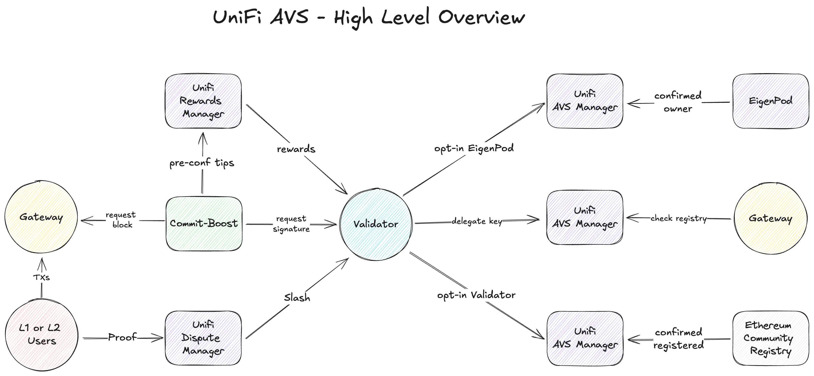

# Overview
UniFi AVS is composed of off-chain software for handling pre-conf operations, and on-chain contracts for handling registrations, rewards, and punishments.

The following diagram highlights how these components interact with each other:
> 

## Preconf Flow

## Node Software
The following diagram highlights system's main software components:
> 

UniFi AVS has a tight coupling with Commit-Boost, allowing validators to seamlessly participate in the preconfirmation process while maintaining their regular validation duties. Validators will run Commit-Boost alongside their standard validator stack. When they are ready to propose a block, they have the flexibility to choose how they want to handle their preconfirmation responsibilities. Options include:

1. Self-build: The validator can use Commit-Boost to directly handle their preconfirmation responsibilities.
2. Delegate: The validator can use Commit-Boost to delegate their preconfirmation duties to another entity e.g., a sophisticated Gateway.

## Smart Contracts
### `UniFiAVSManager` - AVS Registrations
#### Operator Registration
At a high level it is required for an `Operator` within the EigenLayer contracts to opt-in to the AVS. See the [Operator Registration Process](registration.md#operator-registration-process) section for more details.

#### Delegate Key Registration
Each `Operator` will register a single `delegateKey` that will be used to issue preconfs. See the [Delegate Key Registration](registration.md#delegate-key-registration) section for more details.

#### Validator Registration
If an EigenPod owner has delegated their stake to an `Operator`, then the `Operator` can register the EigenPod's validators as preconferers in the AVS. See the [Validator Registration](registration.md#validator-registration) section for more details.

> **Aside on Neutrality**: In the spirit of neutrality, it is important to keep preconf registrations credibly neutral. As such, the Ethereum community is working to launch a permissionless registry contract that exists outside of any protocols (i.e., outside of Puffer or EigenLayer). To prevent fragmentation, the `UniFiAVSManager` contract will look to this registry as a primary source when validators register, and revert if the validator is not opted-in.

### `RewardsManager` - Rewards Distribution

The rewards distribution in UniFi AVS is designed to provide a consistent and attractive incentive structure for participating validators. Key features of the rewards system include:

1. preconf fees
2. MEV-smoothing mechanism
3. Ether-only payouts
4. Competitive earnings potential

For a comprehensive overview of the rewards distribution system, including its key features, benefits, and impact on the Ethereum ecosystem, see the [Rewards Distribution](rewards.md) document.

### `DisputeManager` - Slashing
UniFi AVS implements slashing to ensure the integrity of the preconfirmation process. This mechanism is designed to penalize validators who break their preconfirmation promises or fail to fulfill their duties.

The slashing mechanism consists of two main components:

1. Safety Faults: Penalties for breaking preconfirmation promises.
2. Liveness Faults: Penalties for missing block proposals.
3. Rewards Stealing: Penalties for 'Rug-Pooling'.

For a detailed explanation of the slashing mechanism, including the types of faults, the slashing process, and future developments, please refer to the [Slashing Mechanism](slashing.md) document.

