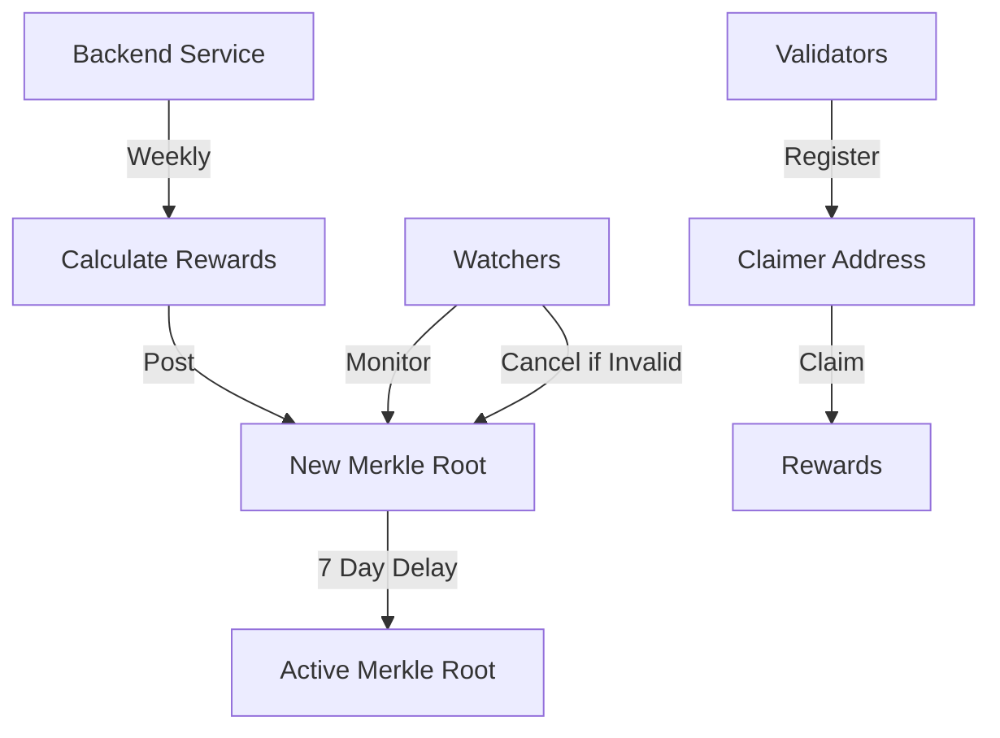

# UnifiRewardsDistributor

## Overview
Smart contract that distributes rewards to validators using Merkle proofs for efficient verification. Validators must register a claimer address before they can receive rewards. The rewards are cumulative and are posted weekly.

## System Flow

## Key Roles

## Validator Registration & Claiming

1. **Claimer Registration**
   - Validator must register a claimer address using BLS signature
   - This address will receive all rewards for the validator
   - Registration is permanent and can't be changed
   - Uses BLS signatures to prove validator ownership

2. **Reward Distribution**
   - Backend calculates rewards weekly
   - Posts new Merkle root with 7-day dispute period
   - Validators can claim after dispute period ends
   - Claims verified using Merkle proofs

### 1. Merkle Root Poster
- Backend service that calculates and posts new reward distributions weekly
- Must be authorized to post new roots

### 2. Merkle Root Cancelers (Watchers)
- Multiple independent watchers monitor new Merkle roots
- Can cancel pending Merkle roots during 7-day dispute period

### 3. Administrator (Multisig)
- Highly secured multi-signature wallet
- Can rescue tokens in emergency situations

## Security

- 7-day dispute period for new Merkle roots
- Multiple watchers for verification
- BLS signature verification for validator claims
- Secure multisig for administrative actions